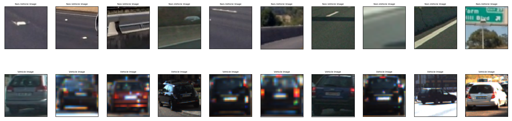
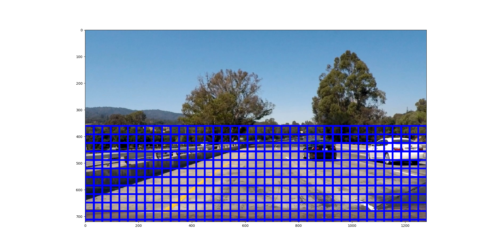
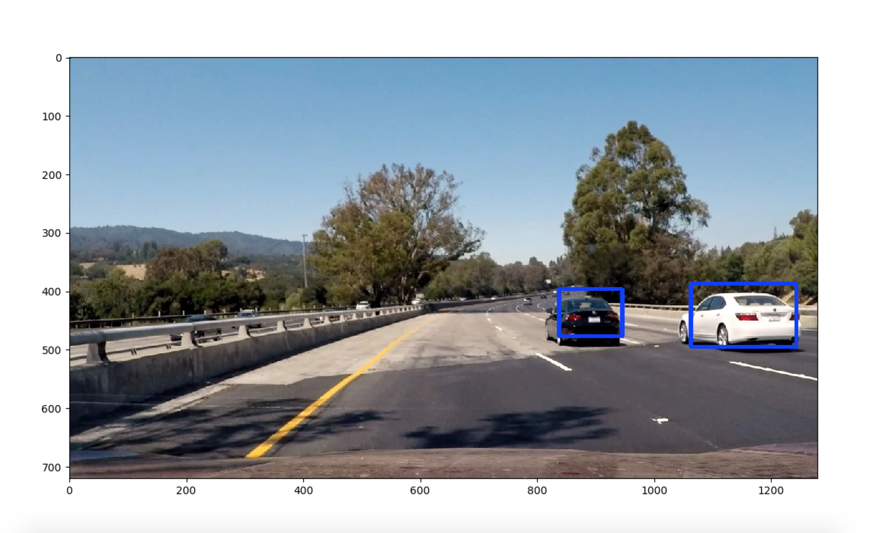

---

**Vehicle Detection Project**

The goals / steps of this project are the following:

* Perform a Histogram of Oriented Gradients (HOG) feature extraction on a labeled training set of images and train a classifier Linear SVM classifier
* Apply a color transform and append binned color features, as well as histograms of color, to  HOG feature vector.
* Normalize your features and randomize a selection for training and testing.
* Implement a sliding-window technique and use trained classifier to search for vehicles in images.
* Run pipeline on a video stream (start with the test_video.mp4 and later implement on full project_video.mp4) and create a heat map of recurring detections frame by frame to reject outliers and follow detected vehicles.
* Estimate a bounding box for vehicles detected.

---

### Data prepare

Load data from different folders.

Load all the GTI data, as well as 'Extra' data provided by Udacity

Shuffle the data for training.

Here are the random chosen image for vehicle and non-vehicle.

###Feature Extraction

When extract the features, different color space generate various quality of result. RGB and HSV didn't provide good enough quality, the LUV color space generate the best quality.

#### Spatial Binning

### Histogram of Oriented Gradients (HOG)

features = hog(img, orientations=9, pixels_per_cell=(8,8),
                       cells_per_block=(2,2),transform_sqrt=False,
                       visualise=False, feature_vector=True)

#### Color Histogram

### Train Model

StandardScaler().fit(X)
scaled_X = X_scaler.transform(X)

Train Test split with 20% test data
train_test_split(scaled_X, y, test_size=0.2, random_state=33)

Use Linear Support Vector Classification to train the model.

    svc = LinearSVC()
    svc.fit(X_train, y_train)

Test accuracy =  0.98170045045

Predict: Choose first 10 test the prediction, all of them are correct.
[ 1.  1.  0.  0.  0.  0.  0.  0.  1.  0.]
[ 1.  1.  0.  0.  0.  0.  0.  0.  1.  0.]

Dump the svc model and scaler, so that don't need train again.

###Sliding Window Search

####1. Test search window

Test search with window (64,64), overlap rate = 0.5

With test image, the sliding windows shows as follow.

####2. Search window and find car in window.

With each sliding window, use the trained svc model to predicted if the window is car or not. If yes, find the the window.

Use selected car window, select the overlap > N. Use the overlap window to generate the heatmap.
When generate the heatmap, I need to filter out the recognized window that is not significant(not enough overlap), first I choose overlap as > 4, the result of the rectangle is too small since not enough overlap.  overlap > 2 generate too many wrong detection. Then finally I choose overlap >3.

Then use the heatmap to generate the final rectangle.

The final rectangle with test images

---

### Video Implementation

####1.

Test video processed.

Project video processed.

####2.

###

---

###Discussion

####1.
