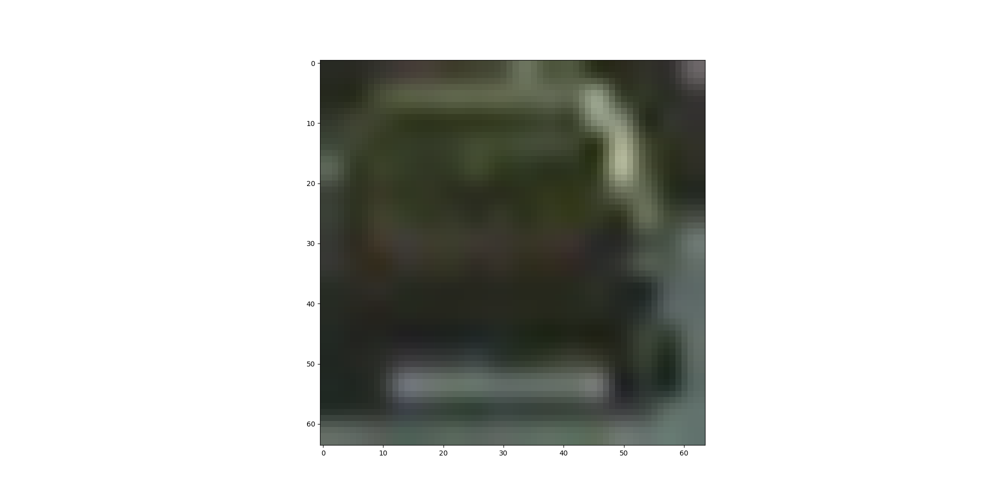
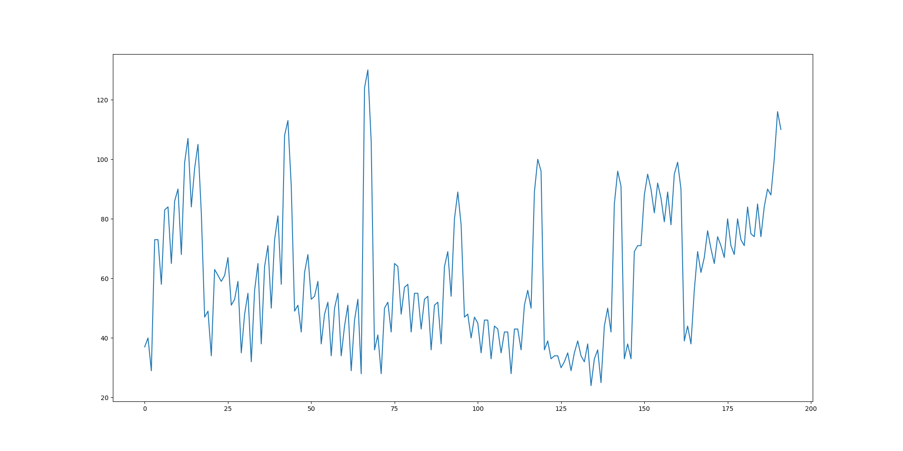

---

**Vehicle Detection Project**

The goals / steps of this project are the following:

* Perform a Histogram of Oriented Gradients (HOG) feature extraction on a labeled training set of images and train a classifier Linear SVM classifier
* Apply a color transform and append binned color features, as well as histograms of color, to  HOG feature vector.
* Normalize your features and randomize a selection for training and testing.
* Implement a sliding-window technique and use trained classifier to search for vehicles in images.
* Run pipeline on a video stream (start with the test_video.mp4 and later implement on full project_video.mp4) and create a heat map of recurring detections frame by frame to reject outliers and follow detected vehicles.
* Estimate a bounding box for vehicles detected.

---

### Data prepare

Load data from different folders.

Load all the GTI data, as well as 'Extra' data provided by Udacity

Shuffle the data for training.

Here are the random chosen image for vehicle and non-vehicle.

###Feature Extraction

When extract the features, different color space generate various quality of result. RGB and HSV didn't provide good enough quality, the LUV color space generate the best quality.

#### Spatial Binning

Use  color_space = 'RGB' to calculate the spatial binning

#### Histogram of Oriented Gradients (HOG)

Use all hog channel to calculate the HOG.
Block set as 4*4 and pixels per cell as 16x16 get better result than (8,8) and 2x2

features = hog(img, orientations=9, pixels_per_cell=(8,8),
                       cells_per_block=(2,2),transform_sqrt=False,
                       visualise=False, feature_vector=True)

#### Color Histogram

Get histogram feature for all 3 color space dimension, RED, GREEN, BLUE, as histogram features.

#### Feature selection comparation

By combining different feature selection combinations, the hog channels with using all HSV channels works best.

### Train Model

StandardScaler().fit(X)
scaled_X = X_scaler.transform(X)

Train Test split with 20% test data
train_test_split(scaled_X, y, test_size=0.2, random_state=33)

Use Linear Support Vector Classification to train the model.

    svc = LinearSVC()
    svc.fit(X_train, y_train)

Test accuracy =  0.98170045045

Predict: Choose first 10 test the prediction, all of them are correct.
[ 1.  1.  0.  0.  0.  0.  0.  0.  1.  0.]
[ 1.  1.  0.  0.  0.  0.  0.  0.  1.  0.]

Dump the svc model and scaler, so that don't need train again.

###Sliding Window Search

####1. Test search window

Test search with window (64,64), overlap rate = 0.5

With test image, the sliding windows shows as follow.

####2. Search window and find car in window.

With each sliding window, use the trained svc model to predicted if the window is car or not. If yes, find the the window.
When choosing which window is car, we didn't use only the predict result, but also use the decision function score. Here I set score > 2.
score = svc.decision_function(test_features)

Use selected car window, select the overlap > N. Use the overlap window to generate the heatmap.
When generate the heatmap, I need to filter out the recognized window that is not significant(not enough overlap), first I choose overlap as > 4, the result of the rectangle is too small since not enough overlap.  overlap > 2 generate too many wrong detection. Then finally I choose overlap >3.

Then use the heatmap to generate the final rectangle.

The final rectangle with test images

### Optimizer

There are a lot of parameters to select, manually choose parameter takes longer time to run and verify the result.

For some of the parameters, such as decision_functions score threshold and overlay number threshold, I wrote a test function 'test_case' to try different parameter combinations and save the result into different folders.
The result shows threshold_overlay = 5, threshold_score = 2 get the best result.

---

### Video Implementation

####1.

Test video processed.

Project video processed.

---

###Discussion

#### For case like image2, need filter lower confident predict result.
#### Better to track the object, follow the object change will make the detection more accurate
#### Speed can be improved.
#### Sliding window size need to be optimized, now it cost too long time to get a result of an image.
#### Maybe pipeline is not ready to work in real world
Since it cost too long time. It's better to reuse the image result from previous frame, it may save a lot of time and make the result more real time, the change also may not jump too much.
#### Left lane images are not well recognized.
I think one reason is that the model didn't use the reversed image to train.  If we train the model to recognize the left side cars, better to train the model to identify the direction of the car, same direction or against the car.
#### False positives such as shadows.
To solve this problems, use different ways to extract features, also generate more labeled data for that.
#### CNN
Another solution to use CNN to classify the car vs non-car

